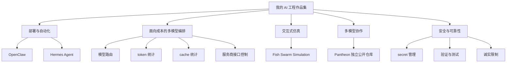

# 个人 AI Agent 工程作品集

这是我的 AI / Agent 工程作品集总入口，用来展示我如何部署、构建、评估和控制多模型 Agent 系统。内容覆盖部署、面向成本的多模型编排、交互式原型、多模型协作，以及安全与可靠性实践。

这个仓库是作品集总入口，不是把所有独立项目代码复制到一个单一仓库。它包含适合公开展示的文档、导航和部分可运行项目；独立维护的项目会通过链接跳转。

English version / 英文版：
https://github.com/yusongcao2004/personal-llm-agent-stack

## 重点作品

### 1. Pantheon —— 基于 Telegram 的多模型圆桌讨论系统

**状态：** 可运行的公开项目

Pantheon 让 GPT、DeepSeek、Doubao 和 Gemini 在 Telegram 群中进行短轮次讨论。用户 @ 哪个机器人（bot），哪个模型先发言；讨论按有限轮次推进；结束后系统输出提示词（prompt）约束下的中立汇总，并记录 token 和 cache 统计。

- [独立源码仓库](https://github.com/yusongcao2004/pantheon-llm-roundtable)
- [中文项目展示页](projects/pantheon/README.md)

Pantheon 作为独立公开仓库维护。本作品集总入口不重复维护它的完整源码。

### 2. 个人 Agent 部署实践 —— OpenClaw 与 Hermes Agent 探索

**状态：** 部署与系统设计文档

OpenClaw 和 Hermes Agent 是第三方工具。这个仓库展示的是我围绕它们进行部署、接入、配置、路由、安全边界和 Agent 工作流程的思考，不声称我是这些框架的作者。

相关文档：

- [部署说明](DEPLOYMENT.md)
- [安全说明](SAFETY_NOTES.md)
- [经验总结](LESSONS_LEARNED.md)

### 3. 面向成本的多模型编排

**状态：** 跨项目体现的工程能力

面向成本的多模型编排目前不是一个独立发布的软件包。它是通过 Pantheon 和路由策略文档展示出来的工程能力：

- 用低成本模型替代不必要的旗舰模型调用；
- 组合多个模型服务商的模型；
- 记录每次讨论的 token 和 cache 统计；
- 使用有边界的讨论轮次和简洁提示词控制成本与长度；
- 处理不同服务商的接口兼容问题；
- 为成本敏感的参与模型控制思考模式。

参见 [ROUTING_STRATEGY.md](ROUTING_STRATEGY.md) 和 [Pantheon 中文展示页](projects/pantheon/README.md)。

### 4. Fish Swarm Simulation —— 基于 Codex 协作开发的交互式鱼群仿真原型

**状态：** 可运行原型

Fish Swarm Simulation 是这个仓库内嵌的可运行项目。它展示了与 Codex 协作进行迭代开发、控制项目范围、优化仿真性能，并通过测试、lint 和构建做验证的过程。

- [项目 README](projects/fish-swarm-simulation/README.md)
- [3D 截图](docs/screenshots/fish-swarm/fish-swarm-3d.jpg)
- [2D 截图](docs/screenshots/fish-swarm/fish-swarm-2d.jpg)

### 5. 安全与可靠性实践

**状态：** 跨项目工程纪律

这个作品集强调保守、清晰的工程实践：

- 使用 `.env` 隔离 secret，保持源码仓库清洁；
- 对有实际影响的操作保留人工确认与复核；
- 对作者身份和项目成熟度做保守公开表述；
- 明确中立汇总的能力边界；
- 明确多模型一致意见不等于事实核查；
- 公开发布前先做测试与检查。

参见 [SAFETY_NOTES.md](SAFETY_NOTES.md)。

## 作品集架构图

## 仓库导航

- [DEPLOYMENT.md](DEPLOYMENT.md)：个人 Agent 系统的部署假设、环境边界和运行说明。
- [ROUTING_STRATEGY.md](ROUTING_STRATEGY.md)：模型路由标准、成本意识、升级与备用方案。
- [SAFETY_NOTES.md](SAFETY_NOTES.md)：人工确认、权限边界、可靠性实践和可能的失败方式。
- [LESSONS_LEARNED.md](LESSONS_LEARNED.md)：围绕个人 Agent 系统文档化和工程思考得到的经验。
- [projects/fish-swarm-simulation/](projects/fish-swarm-simulation/README.md)：内嵌可运行的 Codex 协作仿真原型。
- [projects/pantheon/README.md](projects/pantheon/README.md)：Pantheon 中文项目展示页，不复制源码。
- [Pantheon 独立公开仓库](https://github.com/yusongcao2004/pantheon-llm-roundtable)：基于 Telegram 的多模型圆桌讨论系统源码仓库。
- [SYNC_TO_ENGLISH.md](SYNC_TO_ENGLISH.md)：中文镜像后续同步回英文版的记录。

## 诚实限制

- 本仓库不是一个统一可部署的大型 Agent 平台。
- OpenClaw 和 Hermes Agent 是第三方项目；这里展示的是我的部署、接入、配置和系统设计实践。
- Pantheon 源码位于独立公开仓库，不在这个作品集总入口中维护完整源码。
- 面向成本的多模型编排目前体现为跨项目工程能力，不是独立发布的软件包。
- 多模型讨论不等于事实核查。
- API 调用会产生真实费用。
- 中立汇总是提示词（prompt）级约束，不是形式化的无偏保证。

## 当前状态

| 方向 | 状态 | 在作品集中的作用 |
| --- | --- | --- |
| Pantheon | 独立仓库中的可运行公开项目 | 多模型 Telegram 协作、短轮次讨论、中立汇总、token/cache 统计 |
| OpenClaw 与 Hermes Agent 探索 | 文档与系统设计 | 围绕第三方工具的部署、接入、路由、边界和工作流程思考 |
| 面向成本的多模型编排 | 跨项目工程能力 | 模型与服务商选择、有边界的讨论轮次、简洁提示词、token 成本意识 |
| Fish Swarm Simulation | 内嵌可运行原型 | Codex 协作开发、交互式工程、性能、范围控制和验证 |
| 安全与可靠性 | 跨项目实践 | secret 管理、人工复核、诚实限制、发布纪律 |
