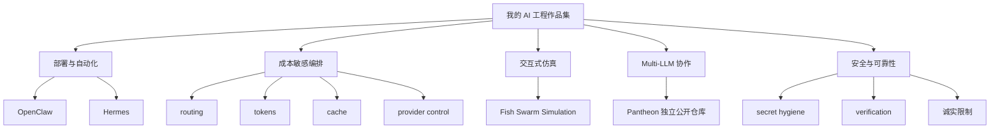

# 个人 AI Agent 工程作品集

这是我的 AI / Agent 工程作品集入口，用来展示我如何部署、构建、评估和控制多模型 Agent 系统。内容覆盖 deployment、cost-aware orchestration、interactive prototyping、multi-LLM coordination，以及 safety / reliability 实践。

这个仓库是 Portfolio Hub，不是把所有独立项目代码复制到一个 monorepo。它包含适合公开展示的文档、导航和部分可运行项目；独立维护的项目会通过链接跳转。

English version / 英文版：
https://github.com/yusongcao2004/personal-llm-agent-stack

## 重点作品

### 1. Pantheon — Telegram-native Multi-LLM Roundtable

**状态：** 可运行的公开项目

Pantheon 让 GPT、DeepSeek、Doubao 和 Gemini 在 Telegram 群中进行短轮次讨论。用户 @ 哪个 bot，哪个模型先发言；讨论按有限轮次推进；结束后系统输出 prompt 约束下的中立汇总，并记录 token/cache statistics。

- [独立源码仓库](https://github.com/yusongcao2004/pantheon-llm-roundtable)
- [中文项目展示页](projects/pantheon/README.md)

Pantheon 作为独立公开仓库维护。本 Portfolio Hub 不重复维护它的完整源码。

### 2. Personal Agent Deployment Stack — OpenClaw & Hermes Exploration

**状态：** 部署与系统设计文档

OpenClaw 和 Hermes Agent 是第三方工具。这个仓库展示的是我围绕它们进行 deployment、integration、configuration、routing、安全边界和 agent workflow 的思考，不声称我是这些框架的作者。

相关文档：

- [部署说明](DEPLOYMENT.md)
- [安全说明](SAFETY_NOTES.md)
- [经验总结](LESSONS_LEARNED.md)

### 3. Cost-Aware Agent Orchestration

**状态：** 跨项目体现的工程能力

Cost-aware orchestration 目前不是一个独立发布的软件包。它是通过 Pantheon 和 routing 文档展示出来的工程能力：

- 用低成本模型替代不必要的旗舰模型调用；
- 组合多个 provider 的模型；
- 记录每次讨论的 token/cache statistics；
- 使用 bounded rounds 和 concise prompting 控制成本与长度；
- 处理不同 provider 的 request compatibility；
- 为成本敏感的参与者控制 thinking mode。

参见 [ROUTING_STRATEGY.md](ROUTING_STRATEGY.md) 和 [Pantheon 中文展示页](projects/pantheon/README.md)。

### 4. Fish Swarm Simulation — Codex-Assisted Interactive Prototype

**状态：** 可运行原型

Fish Swarm Simulation 是这个仓库内嵌的可运行项目。它展示 AI-assisted iterative development、scope control、simulation performance 优化，以及通过 test、lint、build 做验证的过程。

- [项目 README](projects/fish-swarm-simulation/README.md)
- [3D 截图](docs/screenshots/fish-swarm/fish-swarm-3d.jpg)
- [2D 截图](docs/screenshots/fish-swarm/fish-swarm-2d.jpg)

### 5. Safety & Reliability Practices

**状态：** 跨项目工程纪律

这个作品集强调保守、清晰的工程实践：

- `.env` secret isolation 和 source-control hygiene；
- 对有影响的操作保留 human-in-the-loop review；
- 对作者身份和项目成熟度做保守公开表述；
- 明确 neutral synthesis 的限制；
- 明确 multi-model agreement 不等于 factual verification；
- 公开发布前先做测试与检查。

参见 [SAFETY_NOTES.md](SAFETY_NOTES.md)。

## 作品集架构图

## 仓库导航

- [DEPLOYMENT.md](DEPLOYMENT.md)：个人 Agent stack 的 deployment 假设、环境边界和运行说明。
- [ROUTING_STRATEGY.md](ROUTING_STRATEGY.md)：模型 routing 标准、成本意识、升级与 fallback 策略。
- [SAFETY_NOTES.md](SAFETY_NOTES.md)：human oversight、权限边界、可靠性实践和 failure modes。
- [LESSONS_LEARNED.md](LESSONS_LEARNED.md)：围绕个人 Agent 系统文档化和工程思考得到的经验。
- [projects/fish-swarm-simulation/](projects/fish-swarm-simulation/README.md)：内嵌可运行的 Codex-assisted simulation prototype。
- [projects/pantheon/README.md](projects/pantheon/README.md)：Pantheon 中文项目展示页，不复制源码。
- [Pantheon 独立公开仓库](https://github.com/yusongcao2004/pantheon-llm-roundtable)：Telegram-native multi-LLM roundtable 的独立源码仓库。
- [SYNC_TO_ENGLISH.md](SYNC_TO_ENGLISH.md)：中文镜像后续同步回英文版的记录。

## 诚实限制

- 本仓库不是一个统一可部署的大型 Agent platform。
- OpenClaw 和 Hermes Agent 是第三方项目；这里展示的是我的 deployment、integration、configuration 和 system-design 实践。
- Pantheon 源码位于独立公开仓库，不在这个 Portfolio Hub 中维护完整源码。
- Cost-aware orchestration 目前体现为跨项目工程能力，不是独立发布的软件包。
- 多模型讨论不等于事实核查。
- API 调用会产生真实费用。
- Neutral synthesis 是 prompt 级约束，不是形式化的无偏保证。

## 当前状态

| 方向 | 状态 | 在作品集中的作用 |
| --- | --- | --- |
| Pantheon | 独立仓库中的可运行公开项目 | Multi-LLM Telegram coordination、短讨论、synthesis、token/cache accounting |
| OpenClaw & Hermes exploration | 文档与系统设计 | 围绕第三方工具的 deployment、integration、routing、boundary、workflow 思考 |
| Cost-aware orchestration | 跨项目工程能力 | Provider/model selection、bounded rounds、concise prompting、token-aware design |
| Fish Swarm Simulation | 内嵌可运行原型 | Codex-assisted interactive engineering、performance、scope control、verification |
| Safety & reliability | 跨项目实践 | Secret hygiene、review gates、honest limitations、release discipline |
