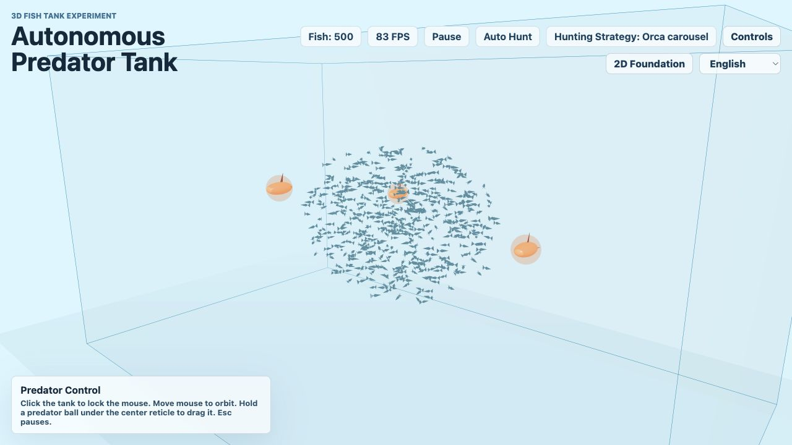
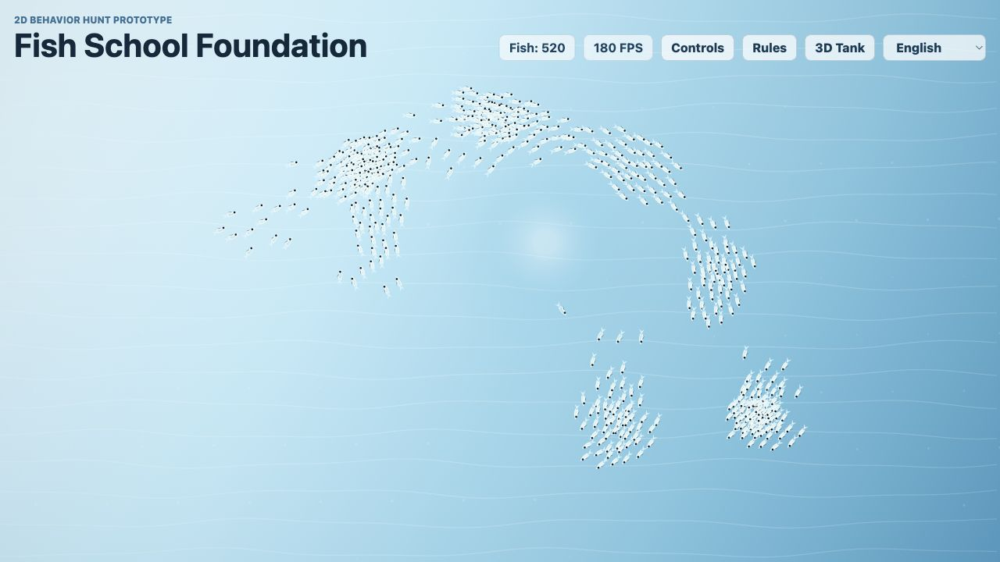

# Fish Swarm Simulation

## Codex-Assisted Swarm Intelligence Experiment

Fish Swarm Simulation 是一个使用 React、TypeScript、Canvas 2D 和 Three.js 构建的交互式鱼群仿真项目。它探索 boids-inspired collective motion、predator pressure、可调 simulation parameters，以及使用 Codex 作为 coding agent 从粗原型迭代到稳定 demo 的过程。

## Demo Preview

### 3D Aquarium Experiment



### 2D Behavior Prototype



当前仓库还没有提交 GIF 或视频。占位说明见 [`docs/demo-gifs/fish-swarm/`](../../docs/demo-gifs/fish-swarm/)。

## 已实现功能

- 2D Canvas fish-schooling simulation，带 mouse predator interaction。
- 3D aquarium simulation，使用鱼缸外 camera 和 autonomous predator balls。
- Boids-inspired separation、alignment、cohesion。
- 2D 和 3D 环境中的 smooth boundary avoidance。
- 基于距离和 local threat 的 predator avoidance。
- 基于 fish speed 和 local companion count 的 deterministic 2D bite mechanics。
- 2D contact penalties、miss cost，以及可在 controls panel 中启用的 optional advanced abilities。
- Sardines、jackfish、herring 风格的 2D behavior presets。
- 3D predator strategies，包括 orca carousel、dolphin drive、shark strike、seal ambush。
- 可配置 simulation parameters、language selection 和 saved custom 2D presets。
- 使用 uniform grid / spatial partitioning 做 fish neighbor lookup。
- 使用 Vitest 覆盖核心 pure simulation logic。

## Interaction Guide

本地运行 app 后打开：

- `/3d`：3D Fish Tank Experiment。
- `/2d`：2D Foundation。

在 2D mode 中：

- 在水域上移动鼠标，鼠标会作为 predator。
- 大的 predator radius 触发鱼群躲避。
- 小的 bite radius 用于 left-click bites。
- 当鱼足够慢且附近同伴足够少时，可以被 kill。
- Controls panel 可以调整 fish count、difficulty、species、school mode、predator settings、penalties 和 optional advanced abilities。

在 3D mode 中：

- 点击鱼缸锁定 pointer。
- 移动鼠标，从鱼缸外 orbit camera。
- 按 `Esc` 释放 pointer 并暂停观察。
- Predator balls 会自动追逐鱼群。
- 将中心准星对准 predator ball 并拖动，可以移动该 predator。
- Camera 被限制在鱼缸外，不进入鱼缸内部。

## Tech Stack

- React
- TypeScript
- Vite
- HTML Canvas 2D API
- Three.js
- React Three Fiber
- `@react-three/drei`
- Vitest
- ESLint

## Engineering Lessons from Codex-Assisted Development

这个项目起点是探索鱼群行为和 predator interaction。Codex 被用作 coding agent，帮助快速生成、修改、测试和整理原型。

主要工程经验是：AI-assisted coding 推进速度很快，但速度越快，scope control 越重要。项目经历了几次方向变化：从简单 2D behavior lab，到更大的 3D game idea，再回到保留 stable baseline，并把实验版本和可运行版本分开。

实践经验：

- 添加更丰富视觉或 game systems 前，先保留 stable baseline。
- 把 experimental work 和当前 runnable app 分开。
- 结构性修改后使用 `lint`、`test`、`build` 验证。
- 保持 simulation logic 和 rendering code 分离。
- 当 fish count 增加时，注意 local-neighborhood search 带来的性能压力。
- 在这个项目规模下，simple uniform grid 比 full all-pairs neighbor checks 更合适。

## Run Locally

安装依赖：

```bash
npm install
```

启动开发服务器：

```bash
npm run dev
```

运行测试：

```bash
npm run test
```

运行 lint：

```bash
npm run lint
```

构建：

```bash
npm run build
```

## 当前状态

| 部分 | 状态 |
|---|---|
| Core fish swarm simulation | Stable prototype |
| 2D mode | Completed interactive prototype |
| 3D mode | Experimental but runnable aquarium prototype |
| Predator interaction | Implemented in both modes |
| Parameter tuning | Implemented |
| Localization | Multiple UI language options |
| Tests | Core logic covered with Vitest |
| Performance optimization | Uses uniform grid / spatial partitioning; very high fish counts remain a stress case |
| Full game loop | Not implemented |

## 与 AI Agent Portfolio 的关系

这个 simulation 本身不是 LLM workflow。它在作品集中的意义是：我用 Codex 作为 coding agent，把一个想法变成交互式系统，迭代行为、debug failures、管理 project scope，并整理成可展示的工程 artifact。

## 当前限制与后续想法

- 3D mode 是 observation experiment，不是完整 game。
- 如果需要动态预览，还需要录制 GIF/video demo material。
- 极高 fish count 仍然可能带来性能压力。
- 后续可以加入更清晰的 milling / bait-ball states、正式 game loop，以及更好的 recording/export tooling。
